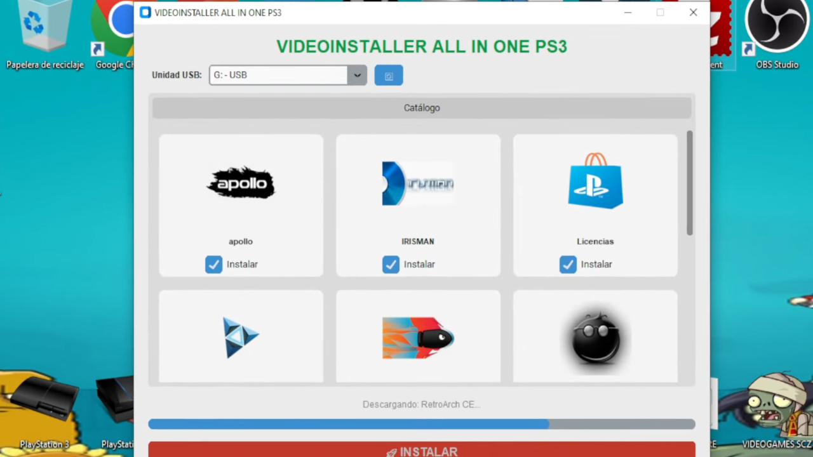

# VideoInstaller - Todo en uno PS3

Esta herramienta definitiva para usuarios de PlayStation 3 te permite preparar una memoria USB en segundos. La aplicación se encarga de **formatear tu pendrive a FAT32** (el formato necesario para PS3) y **descargar automáticamente** las aplicaciones homebrew imprescindibles, dejándolas listas para instalar en tu consola.

## 🚀 Características principales

* **Formato automático FAT32:** Olvídate de herramientas externas. La app formatea tu USB al estándar compatible con PS3 automáticamente.
* **Descarga de homebrew:** Incluye las aplicaciones esenciales de la scene (Multiman, Webman, Irisman, etc.) sin tener que buscarlas una por una.
* **Selección personalizada:** Tú eliges qué aplicaciones quieres copiar. Marca o desmarca las casillas según tus necesidades.
* **Todo en un clic:** Proceso 100% automatizado: Formatea > Descarga > Copia.

## 🛠️ Requisitos

* PC con sistema operativo Windows.
* Una memoria USB (Pendrive) de cualquier capacidad.
* Conexión a Internet (para descargar las apps actualizadas).

## 📖 Instrucciones de uso

1.  **Ejecutar:** Abre la aplicación `VideoInstaller.exe`. **Importante:** Ejecútala como **Administrador** (Clic derecho > Ejecutar como administrador).
    * *Nota: Si te salta el aviso de Windows SmartScreen, dale a "Más información" y "Ejecutar de todas formas".*
2.  **Seleccionar unidad:** En el menú desplegable, elige la letra de tu memoria USB.
    * **⚠️ ADVERTENCIA:** Asegúrate de elegir la letra correcta. El proceso borrará TODOS los datos de esa unidad.
3.  **Elegir apps:** Marca las casillas de las aplicaciones que quieras tener en tu consola.
4.  **Instalar:** Pulsa el botón rojo **"Instalar"**. Espera a que la barra de progreso termine.
5.  **En la PS3:**
    * Conecta el USB a tu consola.
    * Ve a **Administrar Archivos PKG** > **Instalar Archivos PKG** > **Directorio Estándar**.
    * ¡Ahí tendrás todas tus apps listas para instalar!

## ⚠️ Aviso legal y seguridad

Esta herramienta realiza un formateo completo de la unidad seleccionada. **VIDEOGAMES SCZ no se hace responsable** de la pérdida de datos si seleccionas el disco duro equivocado o no haces una copia de seguridad de tu USB antes de usarla.

---
**Desarrollado por VIDEOGAMES SCZ**
*Suscríbete al canal para más herramientas y utilidades.*
